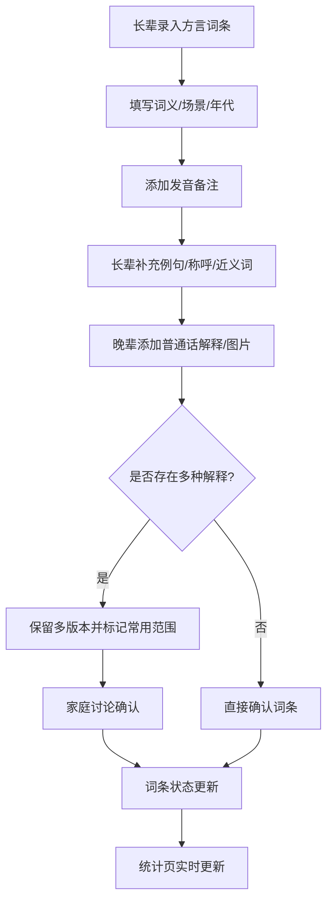

## 1. 产品概述

"方言词汇采集与家庭语义注解平台"是一个面向家庭用户的方言文化传承工具，旨在解决方言词汇在代际传递中的信息流失问题。老人掌握丰富的本地方言词、老行话和旧称呼，但年轻人往往只知大概意思，具体用法和生活场景难以传承。本平台让家庭成员共同录入、注解和管理方言词条，实现方言知识的系统化保存与代际传递。

- **核心问题**：方言词汇在家庭代际传递中信息衰减，缺少系统化记录和多方视角的语义补充
- **目标用户**：希望记录和传承家族方言文化的家庭群体，尤其适合老少共编场景
- **产品价值**：将口耳相传的方言知识转化为结构化数字资产，保留多版本语义差异，促进家庭代际文化交流

## 2. 核心功能

### 2.1 用户角色

| 角色 | 进入方式 | 核心权限 |
|------|----------|----------|
| 长辈录入者 | 直接访问 | 录入词条、补充例句、添加人物关系特殊叫法、标注近义词 |
| 晚辈注解者 | 直接访问 | 添加普通话解释、图片联想、家庭内部备注、确认词条 |
| 浏览者 | 直接访问 | 浏览词条、查看统计、搜索词条 |

### 2.2 功能模块

1. **词条采集页**：方言词条录入、编辑与列表展示，含发音占位、词义、使用场景和年代背景
2. **发音备注页**：为词条添加发音描述、声调标注和语音备注
3. **语义注解页**：多维度语义补充，包括例句、人物关系称呼、近义词辨析和普通话对照
4. **家庭共编页**：多版本解释共存管理，标注常用范围，协作编辑与确认
5. **统计页**：高频词类分布、多义词数量、待确认词条比例、各年代词汇覆盖度

### 2.3 页面详情

| 页面名称 | 模块名称 | 功能描述 |
|----------|----------|----------|
| 词条采集页 | 词条录入表单 | 录入方言词条原文、发音占位符、词义、使用场景描述、年代背景选择 |
| 词条采集页 | 词条列表 | 展示所有已录入词条，支持按年代、词类、确认状态筛选和搜索 |
| 词条采集页 | 词条详情卡 | 展示词条基本信息、关联注解数、版本数和确认状态 |
| 发音备注页 | 发音标注表单 | 添加国际音标/拼音标注、声调描述、发音备注文字 |
| 发音备注页 | 发音列表 | 按词条查看所有发音备注，标注备注人角色（长辈/晚辈） |
| 语义注解页 | 例句补充 | 为词条添加使用例句，标注使用场景和年代 |
| 语义注解页 | 人物关系称呼 | 记录特定人物关系中的特殊叫法及称谓映射 |
| 语义注解页 | 近义词辨析 | 标记容易混淆的近义词，说明差异和适用语境 |
| 语义注解页 | 普通话对照 | 添加普通话解释和标准说法对照 |
| 语义注解页 | 图片联想 | 上传或关联与词条相关的图片帮助理解 |
| 家庭共编页 | 版本管理 | 同一词条存在多种解释时保留不同版本，标记常用范围 |
| 家庭共编页 | 协作编辑 | 显示每位贡献者的编辑内容和角色标识 |
| 家庭共编页 | 确认机制 | 晚辈标记词条为"已确认"，长辈可补充"需修订" |
| 统计页 | 高频词类分布 | 饼图/柱图展示各词类词条数量分布 |
| 统计页 | 多义词统计 | 展示有多个版本解释的词条数量和占比 |
| 统计页 | 待确认词条 | 展示尚未确认的词条比例和列表 |
| 统计页 | 年代覆盖度 | 按年代区间展示已录入词条数量 |

## 3. 核心流程

1. **词条录入流程**：长辈在词条采集页录入方言词条 → 填写发音占位、词义、使用场景和年代 → 保存到系统
2. **语义补充流程**：长辈为例句、人物关系称呼、近义词添加补充 → 晚辈添加普通话解释和图片联想 → 系统保留所有版本
3. **多版本管理流程**：同一词条出现不同解释 → 系统自动保留各版本 → 标记常用范围和地域差异 → 家庭成员讨论确认
4. **统计查看流程**：用户进入统计页 → 查看各类统计图表 → 了解方言词汇采集进度和文化覆盖情况

## 4. 用户界面设计

### 4.1 设计风格

- **主色调**：暖赭色（#C8553D）作为主色，搭配米黄色（#F2E8CF）作为背景，墨绿色（#2D6A4F）作为辅助色——营造温暖、传统、书卷气的文化氛围
- **次色调**：淡褐色（#D4A373）用于卡片和边框，深灰色（#3D3D3D）用于正文文字
- **按钮风格**：圆角矩形（8px），带微妙阴影，hover 时轻微上浮
- **字体**：标题使用"ZCOOL XiaoWei"（站酷小薇体）体现传统文化气质，正文使用"Noto Sans SC"保证可读性
- **布局风格**：左侧导航栏 + 右侧内容区，卡片式内容展示，间距宽松舒适
- **图标风格**：使用 Lucide 图标库，线性风格，与整体简洁古典风格协调

### 4.2 页面设计概览

| 页面名称 | 模块名称 | UI 元素 |
|----------|----------|---------|
| 词条采集页 | 词条录入表单 | 表单卡片居中，输入框带标签，年代选择下拉框，场景文本域，提交按钮 |
| 词条采集页 | 词条列表 | 网格卡片布局，每卡显示词条名、年代标签、确认状态徽章、注解计数 |
| 词条采集页 | 词条详情卡 | 展开式面板，基础信息+关联注解，标签式切换不同维度 |
| 发音备注页 | 发音标注表单 | 紧凑表单，音标输入框+声调选择器+备注文本域 |
| 发音备注页 | 发音列表 | 时间线式排列，按词条分组，角色标签区分长辈/晚辈 |
| 语义注解页 | 例句补充 | 卡片式例句展示，每个例句配场景标签和年代标签 |
| 语义注解页 | 人物关系称呼 | 关系图谱可视化，节点为称呼，连线为关系 |
| 语义注解页 | 近义词辨析 | 对比卡片，左右分栏展示近义词及差异说明 |
| 语义注解页 | 普通话对照 | 双语对照卡片，方言词与普通话词并列 |
| 家庭共编页 | 版本管理 | 版本时间线，每个版本卡片展示内容、贡献者和常用标记 |
| 家庭共编页 | 协作编辑 | 侧边栏贡献者列表，主区域编辑内容，角色颜色区分 |
| 统计页 | 高频词类分布 | 环形图+图例，hover 显示具体数量 |
| 统计页 | 多义词统计 | 数字卡片+占比进度条 |
| 统计页 | 待确认词条 | 环形进度图+待确认词条快捷列表 |
| 统计页 | 年代覆盖度 | 横向柱图，按年代区间展示词条数量 |

### 4.3 响应式设计

- 桌面优先设计，主内容区最大宽度 1280px
- 平板端导航栏收缩为汉堡菜单
- 移动端单列布局，卡片全宽展示

### 4.4 动效设计

- 页面切换：淡入淡出过渡
- 卡片hover：轻微上浮 + 阴影增强
- 统计图表：数据加载时从零动画绘制
- 词条详情展开：高度过渡动画
- 版本时间线：滚动触发渐入效果
