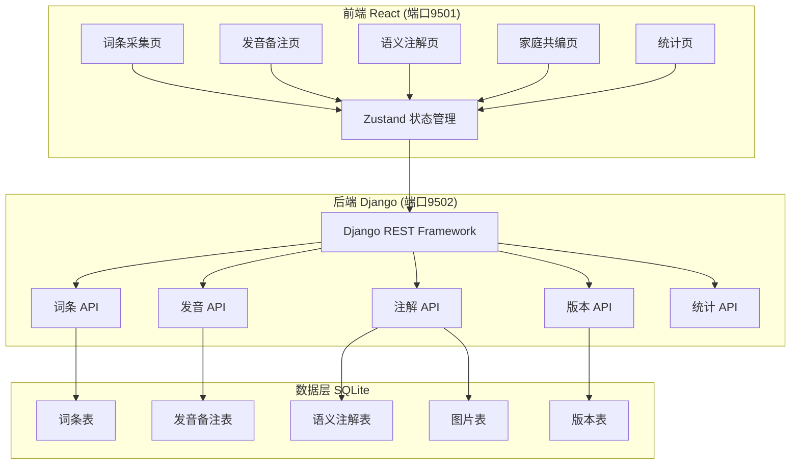
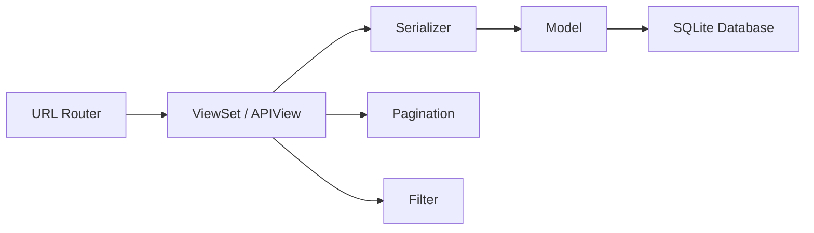
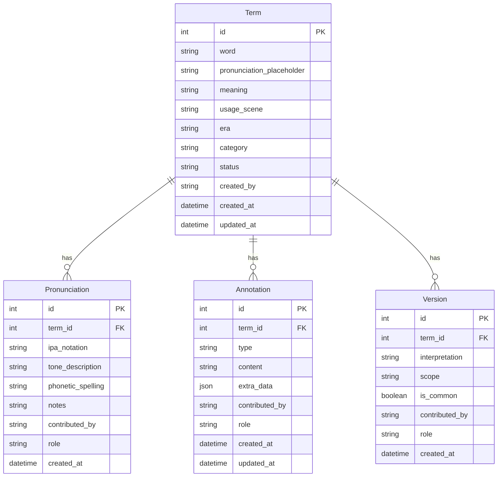

## 1. 架构设计



## 2. 技术说明

- **前端**：React@18 + TypeScript + Tailwind CSS@3 + Vite + Zustand + React Router
- **前端初始化工具**：vite-init（react-ts 模板）
- **后端**：Django@5 + Django REST Framework + django-cors-headers
- **数据库**：SQLite（轻量级，适合家庭级应用）
- **图表库**：Recharts（React 图表组件库）
- **图标库**：lucide-react

## 3. 路由定义

| 路由 | 用途 |
|------|------|
| `/` | 首页，重定向到词条采集页 |
| `/collection` | 词条采集页，录入和浏览方言词条 |
| `/pronunciation` | 发音备注页，管理词条发音标注 |
| `/annotation` | 语义注解页，多维度补充词条语义 |
| `/collaboration` | 家庭共编页，多版本管理与协作 |
| `/statistics` | 统计页，展示各类统计图表 |

## 4. API 定义

### 4.1 词条 API

```
GET    /api/terms/              获取词条列表（支持筛选：年代、词类、确认状态、搜索）
POST   /api/terms/              创建新词条
GET    /api/terms/{id}/         获取词条详情
PUT    /api/terms/{id}/         更新词条
DELETE /api/terms/{id}/         删除词条
```

**词条数据结构：**
```typescript
interface Term {
  id: number;
  word: string;
  pronunciation_placeholder: string;
  meaning: string;
  usage_scene: string;
  era: string;
  category: string;
  status: 'pending' | 'confirmed' | 'needs_revision';
  created_by: string;
  created_at: string;
  updated_at: string;
}
```

### 4.2 发音备注 API

```
GET    /api/pronunciations/              获取发音列表（支持按词条筛选）
POST   /api/pronunciations/              创建发音备注
PUT    /api/pronunciations/{id}/         更新发音备注
DELETE /api/pronunciations/{id}/         删除发音备注
```

**发音备注数据结构：**
```typescript
interface Pronunciation {
  id: number;
  term: number;
  ipa_notation: string;
  tone_description: string;
  phonetic_spelling: string;
  notes: string;
  contributed_by: string;
  role: 'elder' | 'youth';
  created_at: string;
}
```

### 4.3 语义注解 API

```
GET    /api/annotations/              获取注解列表（支持按词条、类型筛选）
POST   /api/annotations/              创建注解
PUT    /api/annotations/{id}/         更新注解
DELETE /api/annotations/{id}/         删除注解
```

**语义注解数据结构：**
```typescript
interface Annotation {
  id: number;
  term: number;
  type: 'example_sentence' | 'kinship_term' | 'synonym' | 'mandarin_translation' | 'image_association' | 'family_note';
  content: string;
  extra_data: Record<string, string>;
  contributed_by: string;
  role: 'elder' | 'youth';
  created_at: string;
  updated_at: string;
}
```

### 4.4 版本 API

```
GET    /api/versions/              获取版本列表（支持按词条筛选）
POST   /api/versions/              创建新版本
PUT    /api/versions/{id}/         更新版本（标记常用范围等）
DELETE /api/versions/{id}/         删除版本
```

**版本数据结构：**
```typescript
interface Version {
  id: number;
  term: number;
  interpretation: string;
  scope: string;
  is_common: boolean;
  contributed_by: string;
  role: 'elder' | 'youth';
  created_at: string;
}
```

### 4.5 统计 API

```
GET    /api/statistics/category_distribution/     获取词类分布统计
GET    /api/statistics/polysemy_count/            获取多义词统计
GET    /api/statistics/pending_ratio/             获取待确认词条比例
GET    /api/statistics/era_coverage/              获取年代覆盖度统计
GET    /api/statistics/overview/                  获取总览统计
```

## 5. 服务端架构图



## 6. 数据模型

### 6.1 数据模型定义



### 6.2 数据定义语言

```sql
CREATE TABLE terms_term (
    id INTEGER PRIMARY KEY AUTOINCREMENT,
    word VARCHAR(100) NOT NULL,
    pronunciation_placeholder VARCHAR(200) DEFAULT '',
    meaning TEXT DEFAULT '',
    usage_scene TEXT DEFAULT '',
    era VARCHAR(50) DEFAULT '',
    category VARCHAR(50) DEFAULT '',
    status VARCHAR(20) DEFAULT 'pending',
    created_by VARCHAR(100) DEFAULT '',
    created_at DATETIME DEFAULT CURRENT_TIMESTAMP,
    updated_at DATETIME DEFAULT CURRENT_TIMESTAMP
);

CREATE TABLE terms_pronunciation (
    id INTEGER PRIMARY KEY AUTOINCREMENT,
    term_id INTEGER NOT NULL REFERENCES terms_term(id) ON DELETE CASCADE,
    ipa_notation VARCHAR(200) DEFAULT '',
    tone_description VARCHAR(200) DEFAULT '',
    phonetic_spelling VARCHAR(200) DEFAULT '',
    notes TEXT DEFAULT '',
    contributed_by VARCHAR(100) DEFAULT '',
    role VARCHAR(10) DEFAULT 'elder',
    created_at DATETIME DEFAULT CURRENT_TIMESTAMP
);

CREATE TABLE terms_annotation (
    id INTEGER PRIMARY KEY AUTOINCREMENT,
    term_id INTEGER NOT NULL REFERENCES terms_term(id) ON DELETE CASCADE,
    type VARCHAR(50) NOT NULL,
    content TEXT NOT NULL,
    extra_data JSON DEFAULT '{}',
    contributed_by VARCHAR(100) DEFAULT '',
    role VARCHAR(10) DEFAULT 'elder',
    created_at DATETIME DEFAULT CURRENT_TIMESTAMP,
    updated_at DATETIME DEFAULT CURRENT_TIMESTAMP
);

CREATE TABLE terms_version (
    id INTEGER PRIMARY KEY AUTOINCREMENT,
    term_id INTEGER NOT NULL REFERENCES terms_term(id) ON DELETE CASCADE,
    interpretation TEXT NOT NULL,
    scope VARCHAR(200) DEFAULT '',
    is_common BOOLEAN DEFAULT FALSE,
    contributed_by VARCHAR(100) DEFAULT '',
    role VARCHAR(10) DEFAULT 'elder',
    created_at DATETIME DEFAULT CURRENT_TIMESTAMP
);

CREATE INDEX idx_term_category ON terms_term(category);
CREATE INDEX idx_term_era ON terms_term(era);
CREATE INDEX idx_term_status ON terms_term(status);
CREATE INDEX idx_pronunciation_term ON terms_pronunciation(term_id);
CREATE INDEX idx_annotation_term ON terms_annotation(term_id);
CREATE INDEX idx_annotation_type ON terms_annotation(type);
CREATE INDEX idx_version_term ON terms_version(term_id);
```
